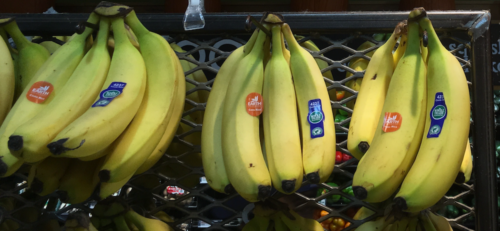
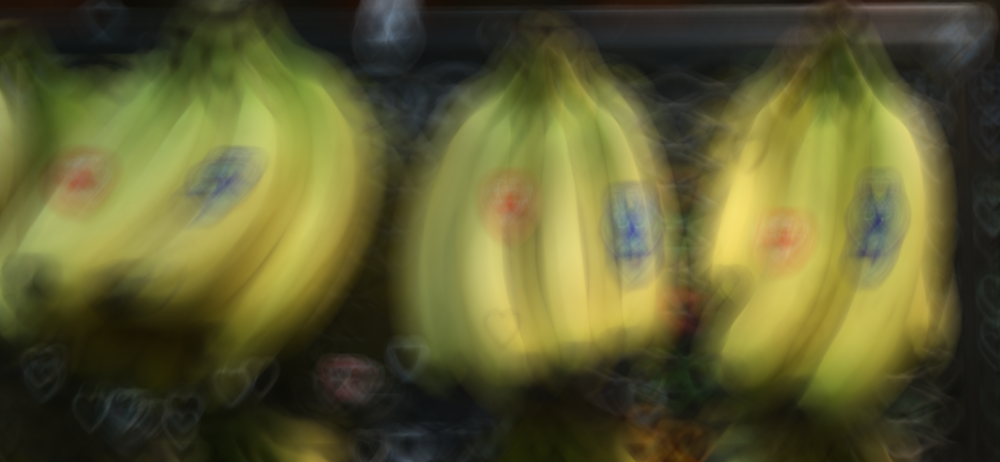

Computer Graphics - Homework Assignment 4 - Image Processing
============================================================

Overview:
---------

In this assignment, you will be implementing image processing operations
based on convolution. You will be able to scale, blur, and sharpen
images, just like Photoshop. You will be able to create effects like
this:

Although these effects look fancy, they are all based on the same
operation: convolution.

Background reading for this assignment: Chapter 9 *Signal Processing* from *Fundamentals of Computer Graphics (4th edition)* by Steve Marschner and Peter Shirley.

Goals:
------

* Understand convolution and image processing.
* Gain insight into high performance image processing algorithms.
* Gain more experience with raster images.

Getting Started & Handing In:
-----------------------------

* Download or clone this code repository. Don't fork it on GitHub, or else your code will be visible to everyone.

* Follow the instructions to install a working development environment: <https://github.com/yig/graphics101> . You do not need to install Qt or any other external libraries for this assignment. The framework provides all the code you need.

* The code will be written in C++. You are encouraged to write helper
functions. They can eliminate a lot of redundant code.

* Build and run the code. The code should compile, but it will complain
when running about not having enough arguments. The program is a command line program.
You should see a message like:

        Usage: ./imageprocessing box radius input_image.png image_out.png
        Usage: ./imageprocessing scale width_percent height_percent input_image.png image_out.png
        Usage: ./imageprocessing convolve filter.png input_image.png image_out.png
        Usage: ./imageprocessing sharpen amount radius input_image.png image_out.png
        Usage: ./imageprocessing edges input_image.png image_out.png
        Usage: ./imageprocessing grey input_image.png image_out.png
        Usage: ./imageprocessing batch commands.txt

* The command `./imageprocessing batch commands.txt` runs each line
in the file `commands.txt` as if those were the command line arguments.
For example, if `commands.txt` is a file containing:

        grey balls.png balls-grey.png
        box 0 balls.png balls-box0.png
        sharpen 2 5 balls.png balls-sharpen-2-5.png

    then running `./imageprocessing batch commands.txt` is equivalent to manually running:

        ./imageprocessing grey balls.png balls-grey.png
        ./imageprocessing box 0 balls.png balls-box0.png
        ./imageprocessing sharpen 2 5 balls.png balls-sharpen-2-5.png

    **Note:** The `batch` command cannot handle spaces in file names.

* Add your code to `convolution.cpp`. You may wish to add helper functions
at the top. There are some suggested signatures.

* Build and run and test that it is working correctly. Qt Creator has a
great debugger.

* Run the following commands on the provided example images (replace `balls`
with the name of each example).

        ./imageprocessing grey balls.png balls-grey.png
        ./imageprocessing box 0 balls.png balls-box0.png
        ./imageprocessing box 3 balls.png balls-box3.png
        ./imageprocessing box 25 balls.png balls-box25.png
        ./imageprocessing edges balls.png balls-edges.png
        ./imageprocessing sharpen 1 5 balls.png balls-sharpen-1-5.png
        ./imageprocessing sharpen 2 5 balls.png balls-sharpen-2-5.png
        ./imageprocessing sharpen 2 10 balls.png balls-sharpen-2-10.png
        ./imageprocessing scale 100 100 balls.png balls-scale-100.png
        ./imageprocessing scale 50 100 balls.png balls-scale-50w.png
        ./imageprocessing scale 10 100 balls.png balls-scale-10w.png
        ./imageprocessing scale 100 50 balls.png balls-scale-50h.png
        ./imageprocessing scale 100 10 balls.png balls-scale-10h.png
        ./imageprocessing scale 50 50 balls.png balls-scale-50.png
        ./imageprocessing scale 10 10 balls.png balls-scale-10.png
        ./imageprocessing scale 200 200 balls.png balls-scale-200.png
        ./imageprocessing scale 50 200 balls.png balls-scale-50w-200h.png
        ./imageprocessing scale 200 50 balls.png balls-scale-200w-50h.png
        ./imageprocessing convolve filters/identity.png balls.png balls-convolve-identity.png
        ./imageprocessing convolve filters/box3.png balls.png balls-convolve-box3.png
        ./imageprocessing convolve filters/box25.png balls.png balls-convolve-box25.png
        ./imageprocessing convolve filters/linear.png balls.png balls-convolve-linear.png
        ./imageprocessing convolve filters/quadratic.png balls.png balls-convolve-quadratic.png
        ./imageprocessing convolve filters/direction.png balls.png balls-convolve-direction.png
        ./imageprocessing convolve filters/heart.png balls.png balls-convolve-heart.png

* The example images are:

    * `balls.png`
    * `bananas.png`
    * `puppy.png`
    * `wave.png`
    * `wikipedia.png`

* I have provided a file `run_all.txt` containing all of the commands
for all of the examples. Run it via `./imageprocessing batch run_all.txt`.
(I have also provided the script `run_all_gen.py` I used to generate
`run_all.txt`.)

* You are encouraged to share blooper images you create while implementing the assignment on Piazza.

* Create a file named `Notes.txt` in the folder. Describe any known issues or extra features. Name people in the class who deserve a star for
helping you (not by giving your their code!).

* When done, zip your entire `imageprocessing` directory and
your `Notes.txt` file as `imageprocessing.zip`.
There is a target named `zip` that will do this for you (`cmake --build . --target zip`)
or you can use the `cpack` command from inside your build directory.
If you create the zip file manually,
do not include your `build` directory. It is large and unnecessary.
Do not include your output images or the `examples` directory, either.
They take up a lot of space and the grader will regenerate them.
Upload your solution to Blackboard before the deadline.

* **THIS IS AN INDIVIDUAL, NOT A GROUP ASSIGNMENT. That means all code
written for this assignment should be original! Although you are
permitted to consult with each other while working on this assignment,
code that is substantially the same will be considered cheating.** In your
`Notes.txt`, please note who deserves a star (who helped you with the
assignment).

Rubric:
-------

*Note: This assignment is scored out of 100. There are 135 points
enumerated below, providing several paths to 100. You could implement
`convolve()`, `blur_box()`, `scale()`, and `edge_detect()`. Or you could skip
one of them and implement `sharpen()` and one of the performance
enhancements.*

1. **(25 points)** Convolve with an arbitrary 2D filter image. The function
signature is:

        // Convolves the `input` image with `filter`,
        // saving the result into `output`.
        // NOTE: This function assumes that `filter` is greyscale
        // (has the same values for red, green, and blue).
        void convolve( const Image& input, const Image& filter, Image& output
        );

    This requires a quadruple for loop. There is no easy way around slow O(n · radius²)
running time (n is the number
of input image pixels). There is a folder of interesting filter images
in the handout. The `main()` function ensures that the values in the
filter image are greyscale, meaning that the same numbers are stored for
red, green, and blue. Because most image formats store their pixel
values as 8-bit numbers, assume that the filter images are stored
**not** normalized. Normalize them when you apply them by dividing by
the sum of all pixel values. Don't forget that the indices into filter
are negated. See the tip below about `.flip().mirror()`.

2. **(25 points)** Blur with a box filter. Blurring with a box filter is
one of the simplest kinds of convolution there is. It simply replaces
each pixel with the unweighted average of nearby pixels. For a box,
nearby pixels are those whose x or y coordinates are differ by at most
radius. The function signature is:

        // Applies a box blur with `radius` to `input`, saving the result
        // into `output`.
        void blur_box( const Image& input, int radius, Image& output );

    A naive implementation of this takes
O(n · radius²) running time (n is the number of
input image pixels). You must implement it with faster running time.
Because a 2D box filter is separable, you can reduce the running time to
O(n · radius) by first blurring horizontally and
then blurring vertically (or vice versa).

    1. **(10 additional points)** Because the box filter is unweighted, it is
theoretically possible to achieve O(n) running time.

3. **(15 points)** Sharpen the image. Sharpening is the opposite of
blurring. Therefore, a simple formula for a sharpened image is:
*sharpen(I) = (1 + α)·I - α·blur(I)*,
where *α* controls the amount of sharpening. You can use your box
blur, and then compute the formula per-pixel. The function signature
is:

        // Sharpens the `input` image by moving `amount` away from a blur with `radius`.
        // Saves the result into `output`.
        void sharpen( const Image& input, real amount, int radius, Image& output );

4. **(25 points)** Scale the image to a new dimension. The function
signature is:

        // Scales the `input` image to the new dimensions, saving the result
        // into `output`.
        void scale( const Image& input, int new_width, int new_height, Image& output );

    In theory, scaling reconstructs a continuous function from the input
image and then resamples it at evenly spaced locations (the pixels of
the output image). The reconstructed continuous function is obtained by
convolving a continuous filter with our discrete input image. Note that
we only need the values of the reconstructed function at output pixel
locations. Therefore, you will iterate over the pixels of the output
image and compute the convolution of a continuous filter with the input
image. The only difference between convolving with a discrete filter
(array) *b* versus a continuous filter *f* is that you will make a
function call *f(x)* or *f(x,y)* to access the filter values instead
of looking them up in an array *b*[x] or *b*[x,y]. The filter you
will use is a triangle function:

    triangle( radius, *x* ) = max( 0, 1 - | *x*/radius | )

    You will need to normalize this on-the-fly.  
    In 2D, the filter is

     *f(x,y)* = triangle( radiusx, *x* ) · triangle( radiusy, *y* )
    
    By picking the right right radius for x and y, the scaling function will
eliminate high frequencies that cause aliasing artifacts. The formula
for the radius is:

        if new_size > old_size: radius = 1
        else: radius = old_size/new_size
    
    where size is the width or height.
Pseudocode for 1D image resizing can be found on slide 53 of *10 Signal
Processing* or in the book (*Fundamentals of Computer Graphics*, Chapter
9 *Signal Processing*).

    1. **(additional 10 points)** The triangle filter is separable, so you can
implement scaling in O(n · radius) time by first
scaling horizontally and then scaling vertically (or vice versa).

5. **(25 points)** Detect edges. Edge detection can be implemented in
various ways. The reference implementation uses 1D convolution with the
filter [ -1 0 1 ]. Convolving with the filter horizontally produces a
*Dx* image and vertically produces a *Dy* image. Note that this filter
cannot be normalized, since it sums to 0. Also note that this filter
will produce positive and negative values; store the absolute value. The
final value for a pixel of the edge detected image is
sqrt( *Dx* ² + *Dy* ² ).
The function signature is:

        // Performs edge detection on the `input` image.
        // Stores the result into `output`.
        void edge_detect( const Image& input, Image& output );

6. **(additional ? points)** Additional operations. Make suggestions!

Tips
----

* All the code you write will go into `convolution.cpp`.

* Convolution operates on the red, green, and blue channels of the image
independently. Ignore alpha. (Even preserving alpha would produce the
wrong result.)

* You will want almost all of the filters you will implement to be
normalized, meaning that their values sum to 1. Only edge detection
makes use of filters which sum to 0. Don't normalize edge detection
filters. The `convolve()` function takes in unnormalized filters; you can
normalize on-the-fly.

* It is easy to normalize on-the-fly by keeping track of the denominator.

* When convolving near the edges of an image, only apply the portion of
the filter that lies in the image (ignore out-of-bounds pixels). When
you do this, you will be ignoring part of the filter. Therefore, the
part of the filter that you do use will no longer sum to one. You will
need to renormalize by dividing by the sum of non-ignored filter values.

* Don't store partial sums in a `ColorRGBA8`, which have only 8-bit precision for
each channel. If your partial sums are real numbers, you would lose a
lot of precision if you round after each addition. If you are
normalizing on-the-fly, the partial sums may overflow, because the sum
of 8-bit numbers often won't fit into another 8-bit number. When storing
the results back into a `ColorRGBA8`, make sure values are in the range
[0,255]. You can use `min()` and `max()` or the provided `clamp()` helper
function.

* You can't perform convolution in-place, because you will be overwriting
values that you still need to read. If a function makes use of separable
convolution, don't forget to create a temporary intermediate image or
array (`std::vector<int>`) as necessary.

* You can halve the amount of code you need to write for separable filters
by iterating with pointers to pixel data. See the discussion of
`image.scanline()` below. For non-separable functions, working with
pointers to pixel data will not reduce the amount of code you write
(though the code will run faster).

* Convolution, correctly defined, says that you iterate over the filter
with flipped (negated) coordinates. This only matters for unsymmetrical
filters. The only ones you will encounter are `heart.png` and
`direction.png`. You should use `filter.flip().mirror()` instead of
`filter` to get the correct results.

* You can compare your output in a few ways:

    * Open both images in a viewer which lets you flip back and forth in-place with, for example, the right and left arrow keys. You could, for example, open them in browser tabs and switch tabs back-and-forth. Rapidly switching back and forth in-place is a good technique to visually understand the differences.

    * With the built-in function `difference()`, accessible from the command line via:

            ./imageprocessing difference input_image1.png input_image2.png image_out.png

    * With the Python script provided in the `examples` directory:

            python imgdiff.py input_image1.png input_image2.png image_out.png

    * Do not use a program which returns true or false based on whether all the bits match. Slightly different implementations can round to slightly different answers, which is fine. Our spec is not bit-exact (and arguably should not be).

Framework functions you need for this assignment
-----------------------------------------

**Image:**

* `image.pixel(x,y)` returns the `ColorRGBA8` color for pixel x,y of a `Image image`.
* `image.pixel(x,y) = c` sets the pixel to a `ColorRGBA8` color `c`. The top left pixel is (0,0), not the bottom left pixel.

* `image.width()` and `image.height()` return the width and height of the
image.

* `image.scanline(y)` returns a pointer to the array of `ColorRGBA8` pixel data for
row y. That pointer points to the pixel (0,y). If you have a pointer to
a pixel `ColorRGBA8* pix`, the next pixel in the row is `pix+1` and the next
pixel in the column is `pix+image.width()`. Therefore, the
pointer to the first pixel in column x is `image.scanline(0)+x`.
By keeping track of the *stride* between pixels, you can write general
functions that iterate over either rows or columns. Such a function
would take a pointer to the first pixel, the stride between pixels, and
the number of pixels. This can substantially reduce the amount of code
you need to write when you only need to iterate over an image's rows or
columns, as opposed to iterating over a square region. The code will
also run faster. For an example of how to use these methods, see the
`greyscale()` function.

* `Image( width, height )` creates a blank image
full of `ColorRGBA8` pixels.
The pixel values are undefined, so set them via `.pixel()` or `.fill()`.

* `Image(image).flip().mirror()` returns a copy of `image` mirrored horizontally and vertically.

`sqrt(x)`, `std::min(a,b)`, `std::max(a,b)`, `lround(x)`, `floor(x)`, `ceil(x)`.
These are part of C's `math.h` (in C++ included as `<cmath>`)
and C++'s `<algorithm>`. You will find them useful.
Note that `std::min` and `std::max` require both
parameters to have the exact same type. If not, you will get a very long
compiler error since they are generic functions written using C++
templates.

**ColorRGBA8** To get the red, green, blue, and alpha components of a
`ColorRGBA8` color `c` as 8-bit values, use `c.r`, `c.g`, `c.b`, and `c.a`.
In this assignment, we are ignoring alpha.
To create an RGB `ColorRGBA8` color, use `ColorRGBA8( red, green, blue )` with
8-bit parameters. Each of the parameters should be an integer number in the
range [0,255], inclusive. Note that `ColorRGBA8` is a
4-byte struct; some packages instead use a `typedef` for an `unsigned int` and
then perform bitwise manipulation to store the appropriate bytes.
